[English](README_en.md) | 中文文档
<!-- 个人资料徽标 -->
<div align="center">
<!--   <a href="https://twitter.com/fandesfyf/"></a>&emsp; -->
  <a href="https://blog.csdn.net/Fandes_F/"></a>&emsp;
  <a href="https://space.bilibili.com/387051620/"></a>&emsp;
<!-- 访客数统计徽标 -->
  </div>
  
# JamTools介绍

JamTools是一个跨平台的小工具集类软件，支持Windows7/8/10/11、Macos、ubuntu系统(其他系统可以直接从源码编译打包)。包含了(滚动/区域)截屏、录屏、(离线)文字识别、多种语言互译、多媒体格式转换、鼠标键盘动作录制播放、局域网文件传输、聊天机器人等功能，完全开源!

部分单独的模块已整理为项目：
[截屏功能](https://github.com/fandesfyf/Jamscreenshot) 
[滚动截屏功能](https://github.com/fandesfyf/roll_screenshot) 
[视频播放器项目](https://github.com/fandesfyf/JamVideoPlayer)
[网页端传输项目](https://github.com/fandesfyf/WEBFilesTransmitter)
[客户端传输项目](https://github.com/fandesfyf/clientFilesTransmitter)

# 功能简介:

- **酱截屏**：                        

截图功能.快捷键Alt+z；支持选区截图、多边形截图、滚动截屏等、支持复制截屏文件或图像数据到剪切板、支持截图中文字识别(翻译)、图像识别等，左侧工具栏提供画笔橡皮擦等简单绘图工具(QQ微信截屏有的都有,没有的也有hh)；支持滚动截屏，滚动过程中支持自动和手动滚动，滚动截屏比FSCapture的拼接准确率更高，并且集成录屏功能，支持截屏时选区录屏。

- **酱识字**：

完全离线的文字识别功能；截屏提取：截屏并提取文字(在截屏界面已经集成小窗的文字识别,更方便使用)；批量识别：可上传一张或多张图片进行文字提取;此外可以使用**右键划屏提字**功能快速提取屏幕上任何地方的文字(用法见'其他功能')

- **酱翻译**：

多语言翻译功能.无快捷键(极简模式下可通过浮窗使用)；输入文字翻译，支持多种语言互译！已集成到截屏等界面下。

- **酱录屏**：

录屏功能.快捷键Alt+c;屏幕录制功能，支持gif等多种格式录制；可以选定录制区，不选则为全屏录制；支持自定义编码速率、帧率、视频质量、声音源鼠标等；录屏结束后点击通知将直接播放！

- **酱转换**：

各种音视频图片(多媒体文件)的裁剪拼接、压缩转码、提取混合等功能...这个的功能太多自行探索...（有点像格式工厂）

- **酱控制**：

鼠标键盘所有动作的录制和(倍速无限次)重放,用于批量重复操作的自动运行，允许设置简单图像比对运行条件,支持将录制的动作作为教程发送给你的小伙伴萌，支持快捷键启动Alt+1录制，Alt+2播放/停止,F4强制停止。注意是不是九宫格的数字1！是字母区上面的数字！动作脚本文件(.jam)可以直接双击或拖入运行！（类似于按键精灵）

- **酱传输**：

提供快速的局域网传输功能(有线或无线wifi链接),有客户端点对点连接传输和网页端共享两种方式。均支持数据双向传输。客户端传输需要通过连接码自动搜索并连接主机，建立连接之后即可互相发送文件或文件夹。网页端传输相当于共享文件夹，支持共享一个文件夹或文件夹下的某几个文件，通过选择对应网络适配器即可生成共享链接，连入该与适配器同一网络的其他设备即可通过链接或扫码访问共享文件，网页端勾选允许上传后支持文件上传，支持网页端传输密码设置，局域网传输比QQ微信传文件更高效快捷，实测通过连接同一热点的手机和电脑单向传输速率约为7MB/s(手机型号不同可能不一样)，校园网内两台电脑的双向传输达到10M/s,看个人网络的配置。

- **酱聊天**：

彩蛋功能。。傻d机器人在线陪聊！！来自思知人工智能平台的机器人（别问为什么不用图灵机器人，因为没q啊！自己搞一个模型也太占空间了。。），填写自定义用户ID后支持多轮对话，服务器有点慢。。。。毕竟思知也是免费提供的，还提供支持知识库训练，不能过多要求哈；默认保留50000字节的聊天记录。。

- **$其他功能**：
  - **划屏提字**：打开软件后可以在任何界面(图片也可)，按下Alt键后用鼠标右键框选一块区域，即可提取出鼠标滑过的轨迹框选区域附近上下设定像素内的文字(并翻译)，可以在设置中心设置详细内容！

  - **剪贴板翻译**：监控剪贴板内容，剪切板内容变化7s内按下shift+ctrl键触发,支持自动中英文翻译,网页自动打开,百度云链接提取码自动复制等！可在设置中心设置详细内容！翻译小窗现在可以通过快捷键alt+x弹出了.

- 小窗模式：(其实就是系统托盘加一个小界面)小窗模式下不会显示主界面，截屏(Alt+z)、小窗翻译(Alt+x)、录屏(Alt+c)、键鼠动作录制(Alt+1)播放(Alt+2)均可以用(用快捷键/系统托盘)调用，所有功能显示均在小窗显示, 不会打开主界面，小窗可以(回车)翻译(英-中),双击系统托盘可以进入主界面
##大部分功能可以在系统托盘调用！

# 功能展示

### 酱截屏(全局快捷键Alt+z)
- 截屏功能页面,包含隐藏窗口、自动保存文件、复制文件还是图像数据、滚动截屏参数等

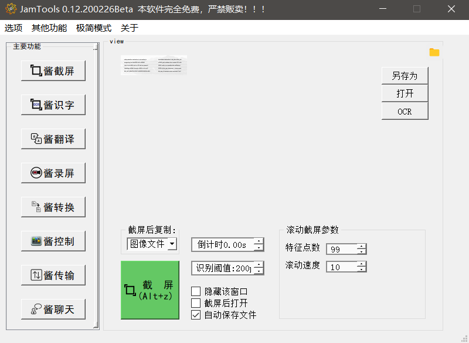

- 支持截屏时选区录屏、文字识别(离线)、翻译等

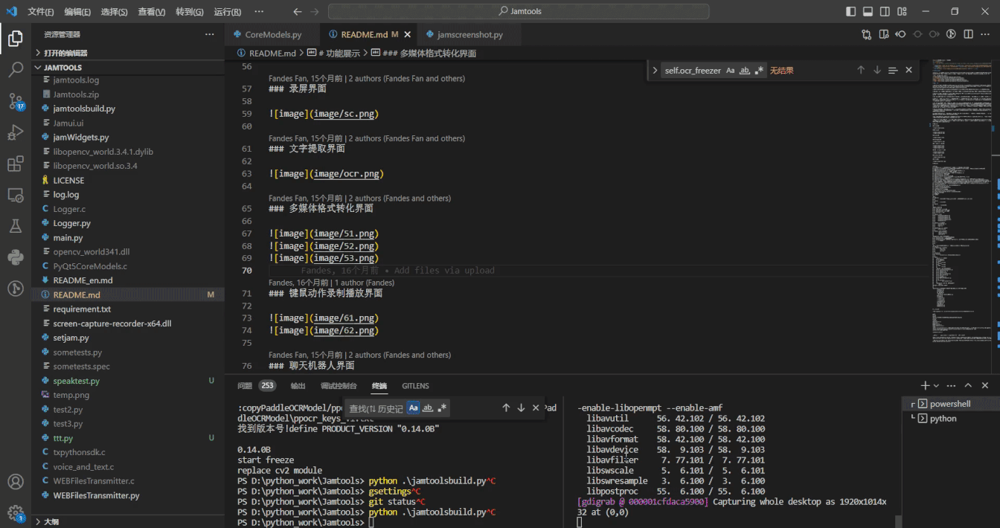

- 支持**滚动截屏**(长截图)


- 截屏时有各种画笔橡皮擦工具、透视裁剪、油漆桶、多边形截图等工具

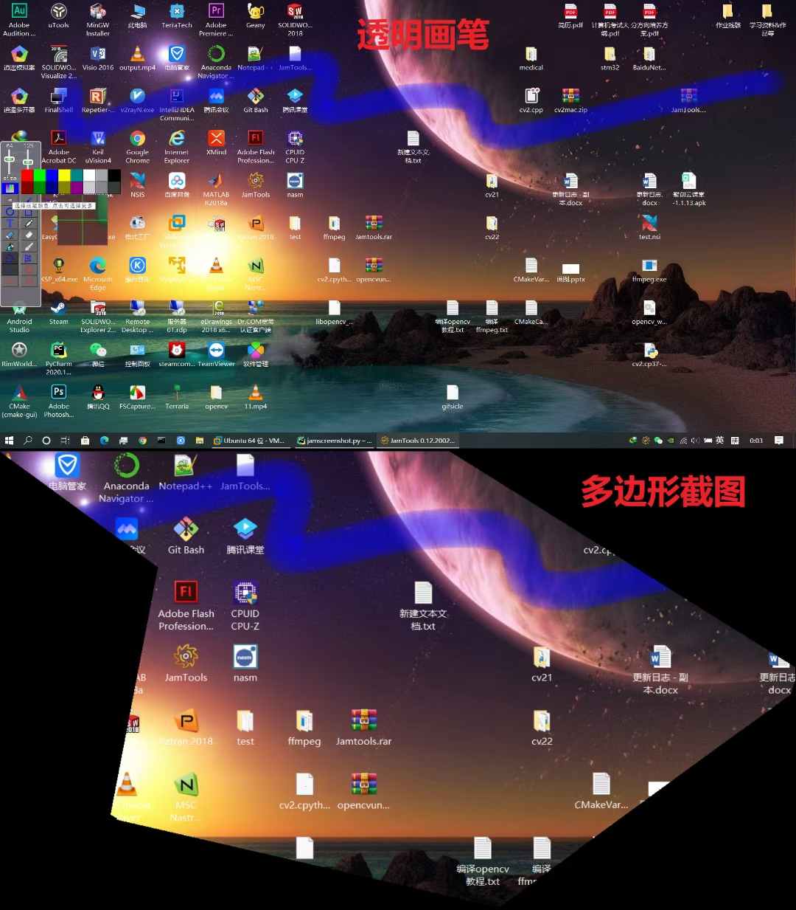
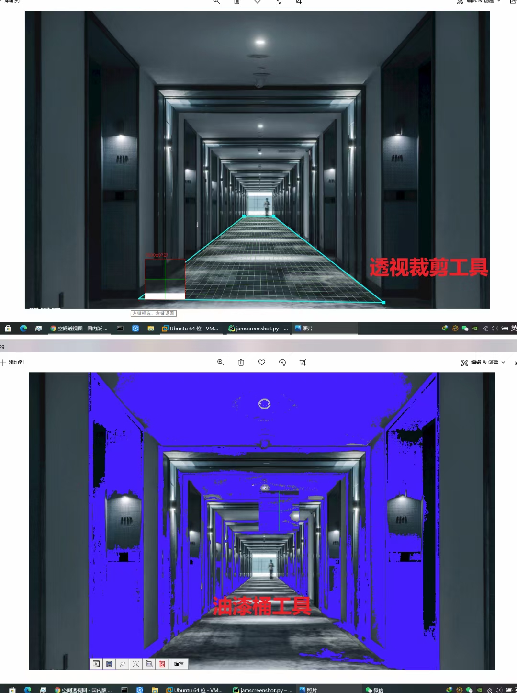

- 支持将截屏固定到屏幕上，固定的截屏可以快速放大缩小(鼠标滚轮)、设置透明度、边框、置顶、文字识别等方便的操作


### 酱录屏(全局快捷键Alt+c)
支持设定录屏区域、录屏码率、帧率、录制鼠标、硬件加速、录制gif等各种常见格式的视频

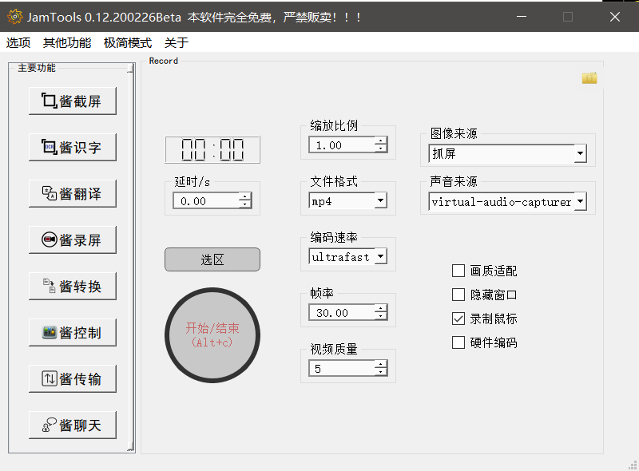

### 酱识字
文字识别已经集成到截屏、固定截屏等页面，也可以通过主窗口的这个页面进行手动调用，支持批量识别。基于paddleocr离线识别。
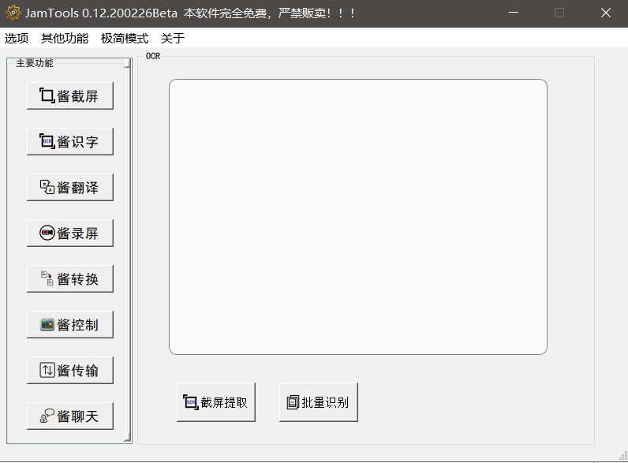

### 酱转换
各种多媒体格式转化

- 裁剪拼接

支持图片、视频、音频的简单裁剪拼接

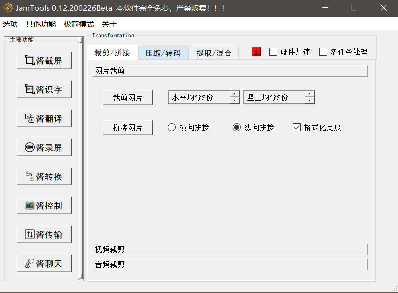

- 压缩转码

支持各种图片批量调整分辨率和格式、批量调整视频码率、帧率、分辨率等；

支持视频批量压缩，视频格式转换(包含gif等常见格式转换)，支持视频批量打马赛克、批量添加、去水印(这个只是添加一个模糊而已)；

支持音频批量格式、码率调整

支持gif批量压缩

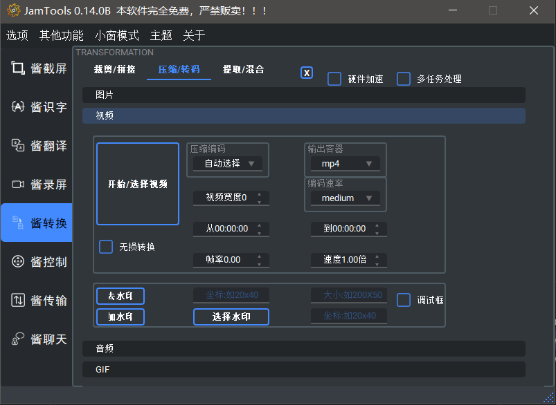

- 提取混合

支持将从视频提取音频、去除音频、混合音频，从视频中抽取图片帧，图片转视频，批量文件重命名等

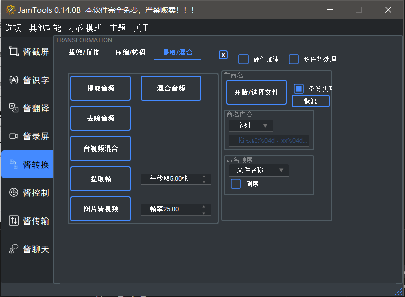

### 酱控制

- 录制你的键鼠动作并无限制重放动作，适用于批量重复操作的自动化，支持简单的播放条件设置

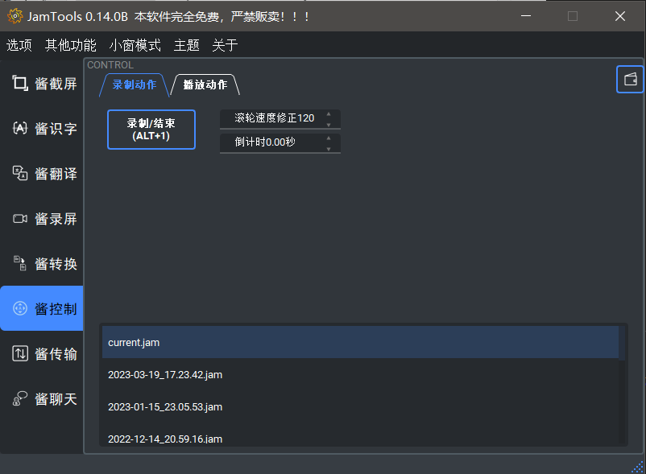
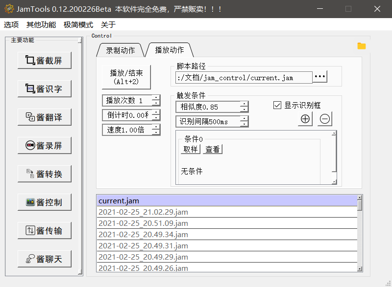

### 酱传输

局域网文件传输功能，能够在局域网内快速传输文件，有通过客户端传输和通过网页端传输两种方式。

- 通过客户端传输，双方都装有jamtools，直接通过连接码建立连接，即可互发文件，支持断点续传、多线程传输

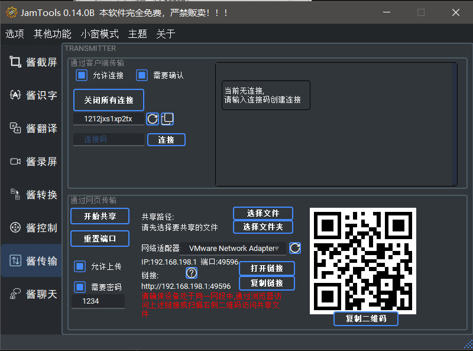

- 网页端传输，有一方安装jamtools，选择共享文件夹，即可共享链接，对方可以下载该文件夹内的文件或者上传文件到文件夹，支持断点续传、多文件批量下载等

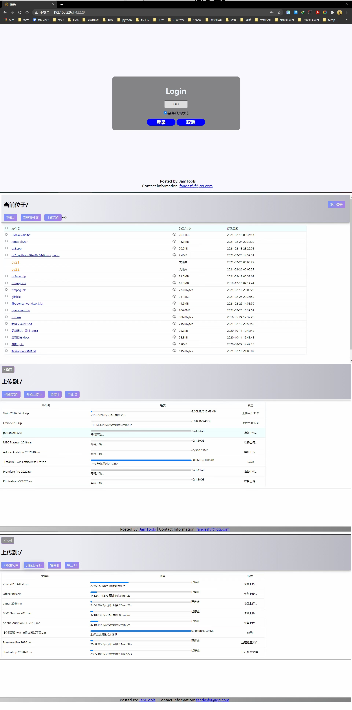

### 酱聊天

- 彩蛋功能，聊天机器人

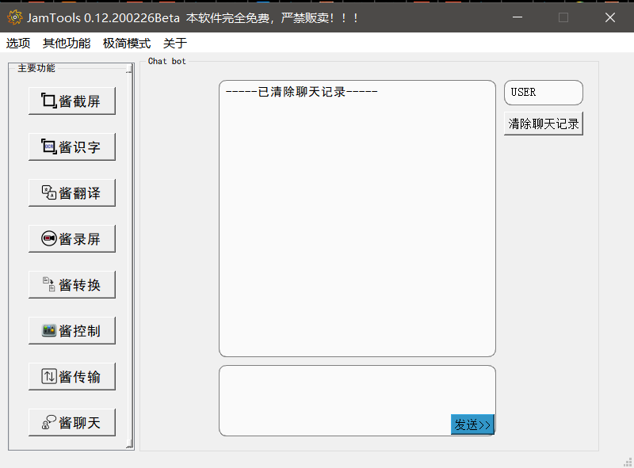

### 其它功能

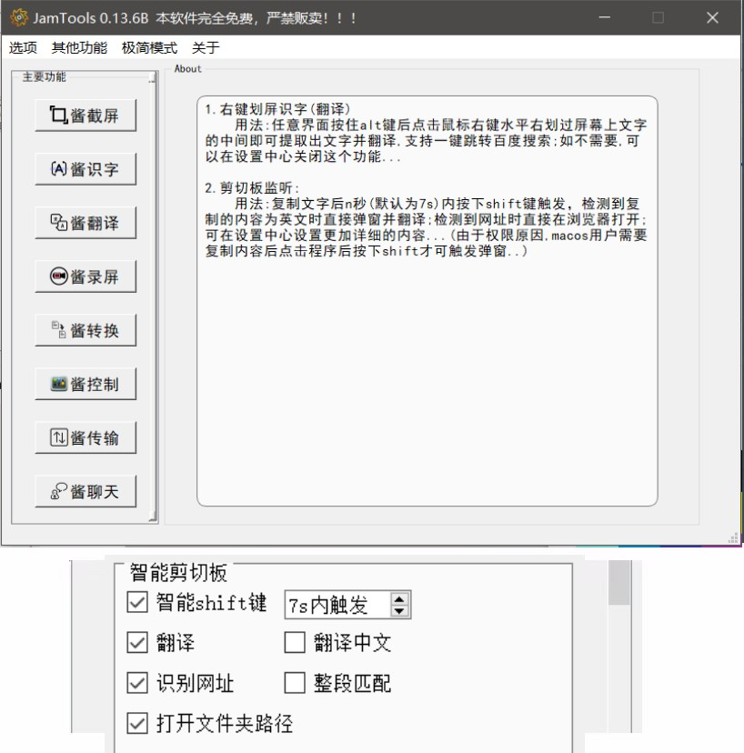

- 右键划屏提字/翻译

按下alt使用鼠标右键框选屏幕，即可快速提取框选中区域的文字并翻译

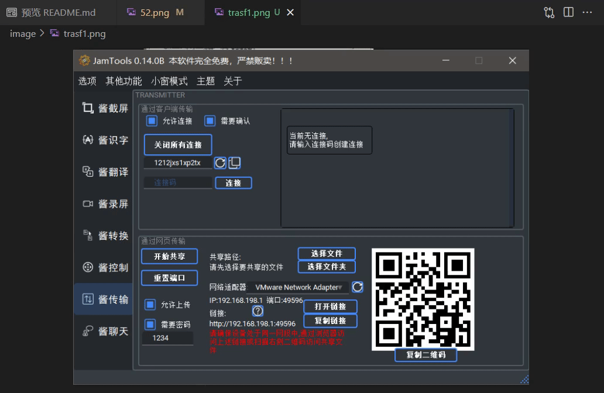

- 智能剪切板，识别到剪切板改变内n秒(可以在设置内更改)，按下shift+ctrl，可以快速翻译、打开链接(快速打开浏览器进入页面)、复制百度云提取码等操作

# 项目目录

```c
目录结构:
│  CoreModels.py //主要核心文件,存放主要功能启动函数的地方,可以直接运行
│  main.py //主程序文件,但是只是用来存放引入库的文件,防止打包出错,运行一键构建脚本将会自动编写该文件
│  WEBFilesTransmitter.py //网页端传输模块
│  WEBFilesTransmittertest.py //网页端传输模块测试例子,单独ui
│  clientFilesTransmitter.py //客户端传输模块
│  clientFilesTransmittertest.py //客户端传输测试例子,单独ui
│  jamcontroller.py //酱控制模块
│  jamscreenshot.py //截屏模块
│  jamroll_screenshot.py //滚动截屏模块
│  jampublic.py //一些非常常用的公共引用类/方法,如翻译文字识别线程类等
│  jamresourse.py //转化的资源文件
│  jamtoolsbuild.py //一键构建脚本,调用该脚本即可自动分析项目引用,自动配置项目文件,自动编译/打包等, 基于fbs，后续将移除
│  setjam.py //附加编译脚本,如在构建脚本中设置了编译,则会调用该脚本将所有库转化为c文件后编译,需要Cython支持
|  以下几个库文件是(作者自行编译的)不同平台下的缩略版opencv库(10M+),现在默认clone的项目将不会包含这些文件(因为太大了clone起来太慢),已经放在release里面了,要小一点的文件的话就自己去下载,或者直接安装完全版的opencv-contrib-python==3.4.2.17(70M+)..
│ \ cv2.cp37-win_amd64.pyd //windows下编译的opencv库,如需扩展功能,请自行安装opencv-contrib-python==3.4.2.17
│ \ opencv_world341.dll
│ \ cv2.cpython-37m-darwin.so //macos下编译的opencv库
│ \ libopencv_world.3.4.1.dylib
│ \ cv2.so //linux下编译的opencv库
│ \ libopencv_world.so.3.4.1
│  requirement.txt //依赖列表
│  audio_sniffer-x64.dll //windows下录音驱动
│  screen-capture-recorder-x64.dll //windows下录屏驱动
│  log.log //日志文件
│  README.md
│  LICENSE
│  
├─bin
│  ├─darwin
│  │     ... //macos下存放ffmpeg和gifsicle可执行文件的文件夹,请自行下载,下同
│  │      
│  ├─linux
│  │     ... //linux下的...
│  │      
│  └─win32
│         ... //window下的..
│          
├─html //网页前端
│  │  favicon.ico
│  │  index.html //登录界面
│  │  jamlistdir.html //下载页面
│  │  jamupload.html //上传页面
│  │  test.html //测试
│  │  
│  ├─fonts //字体
│  │      fontawesome-webfont.eot
│  │      fontawesome-webfont.svg
│  │      fontawesome-webfont.ttf
│  │      fontawesome-webfont.woff
│  │      fontawesome-webfont.woff2
│  │      FontAwesome.otf
│  │      
│  ├─jamcss //css文件夹
│  │      font-awesome.css
│  │      JamTools.css
│  │      login.css
│  │      
│  ├─jamhtmlpic //图标文件夹
│  │      jamdowload.png
│  │      
│  └─jamjs //存放js的文件夹
│          jquery-1.11.0.js
│          jquery.cookie.js
│          spark-md5.js
│          
├─imagefiles //存放图片的文件夹,
│  │  jamresourse.py //转化后的的资源文件
│  │  jamresourse.qrc //资源文件列表
│  │  setjamresourse.py //资源文件一键打包脚本,用于将图片文件转化为py文件,需要pyrcc支持
│  │  ... //图片文件
│  │  ...
│  │  ...
│  │  
│          
├─src //fbs打包的项目文件夹,通过一键构建脚本即可自动配置该目录(不用管)
│  ├─build
│  │  └─settings //打包信息
│  │          base.json
│  │          linux.json
│  │          mac.json
│  │          
│  ├─installer
│  │  └─windows
│  │          Installer.nsi //Windows下的nsis构建脚本
│  │          
│  └─main
│      ├─icons //图标文件夹
│      │  │  Icon.ico
│      │  │  README.md
│      │  ├─base
│      │  │      512.png
│      │  ├─linux
│      │  │      512.png
│      │  └─mac
│      │         512.png
│      │          
│      ├─python //存放源码的文件夹
│      │  │  clientFilesTransmitter.py
│      │  │  jamcontroller.py
│      │  │  jampublic.py
│      │  │  jamresourse.py
│      │  │  jamroll_screenshot.py
│      │  │  jamscreenshot.py
│      │  │  main.py
│      │  │  CoreModels.py
│      │  │  WEBFilesTransmitter.py
│      │  │  
│      │  └─__pycache__
│      │          main.cpython-37.pyc
│      │          
│      └─resources //存放附加资源的文件夹
│          └─base
└─target //fbs打包输出文件夹
│
│
└─testfiles //测试文件存放的文件夹,功能如名,只是用来测试最小例子
        ffmpegtest.py
        text2audio.py
        win32end2.py
        全局快捷键.py
        图片遮罩.py
        拼接部分相同图片(暴力遍历法).py
        比较相同.py
        泛洪填充.py
        滚动截屏2.0.py
        滚动截屏2.1.py
        滚动截屏3.0.py
        滚动截屏demo.py
        特征提取test.py
        相似拼接cv.py
        连接测试.py
        透视变换test.py
        透视裁剪test.py
```

# 使用及依赖

测试环境python3.7.8  in win7/8/10/11、ubuntu20.04/18.04/16.04、MacOS10.13/10.15

```c
Wheel
Pillow
pynput
qrcode
requests
urllib3
pyttsx3
PyInstaller
baidu-aip
PyQt5==5.14
PyQt5-sip
PyQt5-stubs
onnxruntime
shapely
pyclipper
qt_material
numpy
Cython==0.29.21
fake-useragent==0.1.11
setuptools
chardet
comtypes
opencv-python # 如果需要更小体积的cv2,则可以从[这里](https://github.com/fandesfyf/JamTools/releases/tag/0.12.5)下载我重新编译好的删减版

```

也可以通过```pip3 install -r requirement.txt```安装所有依赖

此外,本软件多媒体处理能力主要依赖于[ffmpeg库](https://ffmpeg.org/),需要自行下载[ffmpeg](https://ffmpeg.org/)(用于录屏和多媒体处理)和[gifsicle](http://www.lcdf.org/gifsicle/)(用于gif压缩)可执行文件放到bin目录对应操作系统的文件夹下,方可使用对应功能.

### 打包安装程序

> ~~原本的打包基于fbs库，但是高版本的fbs开始收费了，所以换成了`cx_Freeze`进行打包(感觉更好用了，白嫖真爽！)~~

- 最近发现新版的 pyinstaller 打包pyqt5程序也挺好用的了，改成用`pyinstaller`进行打包(白嫖真爽+1)

```shell
# 需要安装/升级pyinstaller
pip3 install --upgrade pyinstaller
```

- windows/ubuntu下打包：
```shell

pyinstaller installer.spec -y
```
会输出到dist中

- windows 下打包为安装程序：

使用NSIS(Nullsoft Scriptable Install System)打包为安装程序，提供了一个安装程序脚本到`./build/windows/Installer.nsi`中，具体用法可以参考[nsis教程](https://nsis.sourceforge.io/Main_Page)

- ubuntu下打包为deb包：

提供了几个有用的脚本在`./build/ubuntu`下供参考

TODO:
- macos下打包还没有尝试，没有机器，pyinstaller应该是通用的流程，如果有人试过，欢迎提供脚本或教程

