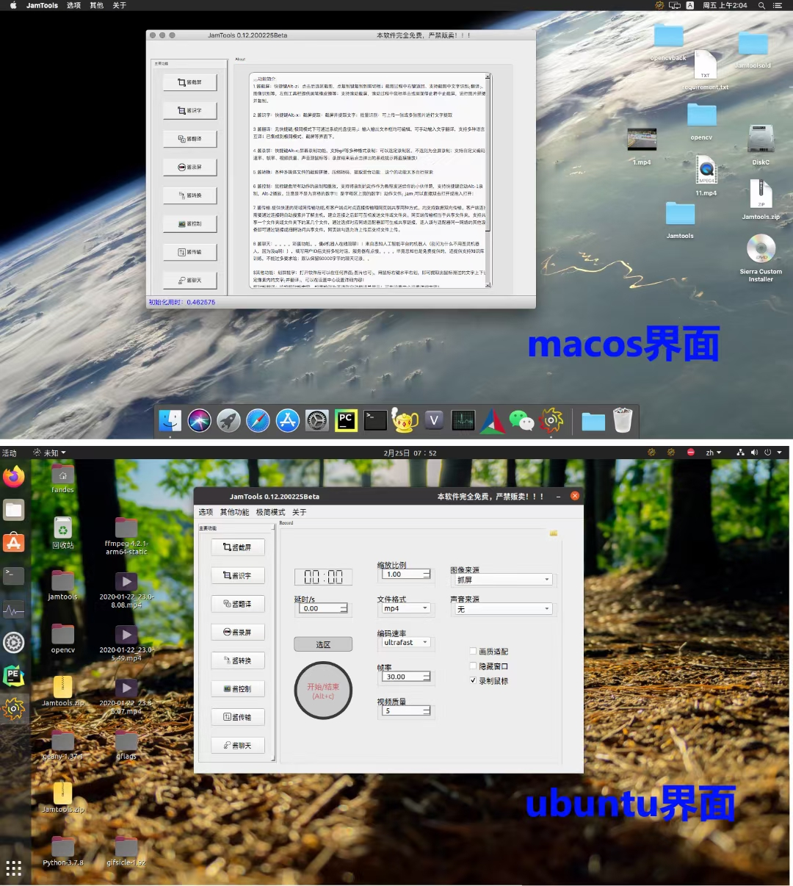

English| [中文文档](README.md) 

# Introduction

Jamtools is a cross platform small tool set software that supports windows7, windows10, MacOS and Ubuntu systems (other systems can be compiled and packaged directly from the source code). It includes screen capture, screen recording, character recognition, multimedia format conversion, mouse and keyboard action recording and playback, LAN file transmission, chat robot and other functions. It is completely open source!

Some independent modules have been sorted into projects:

[screenshot function](https://github.com/fandesfyf/Jamscreenshot )  

[scroll screen capture function](https://github.com/fandesfyf/roll_screenshot )  

[video player project](https://github.com/fandesfyf/JamVideoPlayer ) 

[web side transmission project](https://github.com/fandesfyf/WEBFilesTransmitter ) 

[client transfer item](https://github.com/fandesfyf/clientFilesTransmitter )


# >>>Function introduction:

1. Screenshot: screenshot function. Shortcut key Alt + Z; Support selection screenshots, polygonal screenshots, rolling screenshots, etc., copy screenshot files or image data to the clipboard, support character recognition (translation) and image recognition in screenshots, and the left toolbar provides simple drawing tools such as brush eraser (some QQ wechat screenshots are available, and others are HH); It supports rolling screen capture, and supports automatic and manual rolling during the rolling process. The splicing accuracy of rolling screen capture is higher than that of fscapture, and the integrated screen recording function supports selective screen recording during screen capture.
2. Character recognition: character recognition function; Screenshot extraction. Shortcut key Alt + X: screenshot and extract text; Batch recognition: one or more pictures can be uploaded for text extraction
3. Sauce translation: multi language translation function. No shortcut key (it can be used through floating window in minimalist mode); Input text translation, support multi language translation! It has been integrated into screen capture and other interfaces.
4. Sauce recording screen: recording screen function. Shortcut key Alt + C; Screen recording function, supporting GIF and other formats; You can select the recording area, otherwise it will be full screen recording; Support custom coding rate, frame rate, video quality, sound source, mouse, etc; After the screen recording, click the notice to play directly!
5. Sauce conversion: cutting and splicing, compression and transcoding, extraction and mixing of various audio and video pictures (multimedia files)... There are too many functions to explore by yourself... (a bit like a format factory)
6. Jam control: the recording and playback (unlimited times of speed) of all actions of the mouse and keyboard are used for the automatic operation of batch repeated operations, allowing the setting of simple image comparison operation conditions, supporting the sending of recorded actions to your partner as a tutorial, supporting shortcut keys to start Alt + 1 recording, ALT + 2 playing / stopping, and F4 forced stopping. Pay attention to whether it is the number 1 of the ninth house! It's the number above the letter area! The action script file (. Jam) can be directly double clicked or dragged to run! (similar to key wizard)
7. Data transmission: provide fast LAN transmission function (wired or wireless WiFi link), with two modes: client-side point-to-point connection transmission and web page sharing. Both support two-way data transmission. The client transmission needs to automatically search and connect to the host through the connection code. After the connection is established, files or folders can be sent to each other. The web side transmission is equivalent to a shared folder. It supports sharing a folder or several files under a folder. The shared link can be generated by selecting the corresponding network adapter. Other devices connected to the same network as the adapter can access the shared file through the link or code scanning. The web side checks allow upload, supports file upload, and supports web side transmission password setting, LAN transmission is more efficient and faster than QQ wechat transmission of files. The measured one-way transmission rate of mobile phones and computers connected to the same hotspot is about 7MB / S (different mobile phone models may be different). The two-way transmission of two computers in the campus network reaches 10m / s. It depends on the configuration of personal network.
8. Jam chat:.... Egg function.. Silly D robot chat online!! Robots from Sizhi artificial intelligence platform (don't ask why you don't use Turing robots, because there's no q! It takes up too much space to build a model by yourself.) after filling in the user-defined user ID, multiple rounds of dialogue are supported, and the server is a little slow.... After all, Sizhi is also provided free of charge. It also provides support knowledge base training. You can't ask too much; 50000 bytes of chat records are reserved by default..
$other functions: draw screen and pick up words: after opening the software, you can draw horizontally and right on any interface (pictures can also be used), you can extract the text in the pixels set up and down near the horizontal track crossed by the mouse (and translate), and you can set the details in the setting center!
Clipboard translation: monitor the clipboard content, press shift to trigger the change of clipboard content within 7S, support automatic Chinese-English translation, automatic opening of web pages, automatic copying of Baidu cloud link extraction code, etc! Details can be set in the setting center!
Minimalist mode: (in fact, the system tray plus a small interface) in minimalist mode, the main interface will not be displayed. Screen capture (ALT + Z), character recognition (ALT + x), screen recording (ALT + C), keyboard and mouse action recording (ALT + 1) and playback (Alt + 2) can be called (with shortcut keys / system tray). All functions are displayed in the small window, which can be (enter) translated (English Chinese), Double click the system tray to enter / exit minimalist mode
##Most functions can be called in the system tray!

# Interface show

All pictures can be viewed in the image directory

### Interface under MacOS and Ubuntu



### Screen capture interface


##### Screen capturing


### Screen recording interface


### Text extraction interface


### Multimedia format conversion interface


### Keyboard and mouse action recording and playing interface


### Chat robot interface


### Other functions


# Project directory

```c
directory structure:.
│  test.py //Main program files. Test files.
│  main.py //It is not the main program, but only used to store the imported and stored files to prevent packaging errors. Running the one click build script will automatically write the file
│  WEBFilesTransmitter.py //Web side transmission module
│  WEBFilesTransmittertest.py //Web side transmission module test example, separate UI
│  clientFilesTransmitter.py //Client transport module
│  clientFilesTransmittertest.py //Client transmission test example, separate UI
│  jamcontroller.py //酱控制模块
│  jamscreenshot.py //截屏模块
│  jamroll_screenshot.py //滚动截屏模块
│  jampublic.py //Some very common public reference classes / methods, such as translation character recognition thread class, etc
│  jamresourse.py //转化的资源文件
│  jamtoolsbuild.py //A one click build script can be called to automatically analyze project references, automatically configure project files, and automatically compile / package
│  setjam.py //Attach a compilation script. If compilation is set in the build script, the script will be called to convert all libraries into C files for compilation, which requires Python support
|  The following library files are abbreviated versions of OpenCV Library (10m +) under different platforms (compiled by the author). Now the default clone project will not contain these files (because it is too large and the clone is too slow). They have been placed in the release. If you want a smaller file, Download it yourself, or directly install the full version of OpenCV contrib python = = 3.4.2.17 (70m +)
│ \ cv2.cp37-win_amd64.pyd //windows下编译的opencv库,如需扩展功能,请自行安装opencv-contrib-python==3.4.2.17
│ \ opencv_world341.dll
│ \ cv2.cpython-37m-darwin.so //macos下编译的opencv库
│ \ libopencv_world.3.4.1.dylib
│ \ cv2.so //linux下编译的opencv库
│ \ libopencv_world.so.3.4.1
│  PyQt5CoreModels.py //Intermediate file, copy the main source code here when running the one click build script (HH was used for code confusion before, so it's too lazy to change. This file should be consistent with the test.py file)
│  requirement.txt //Dependency list
│  audio_sniffer-x64.dll //windows下录音驱动
│  screen-capture-recorder-x64.dll //windows下录屏驱动
│  voice_and_text.py //Deprecated. The voice synthesis + voice to text + playback module is not supported because the API call is completed. If you need to use it, you can replace the API yourself
│  txpythonsdk.py //Deprecated. The SDK of Tencent AI platform is rewritten
│  log.log //log file
│  README.md
│  LICENSE
│  
├─bin
│  ├─darwin
│  │     ... //The folder where ffmpeg and gifsicle executable files are stored under MacOS. Please download them yourself, the same below
│  │      
│  ├─linux
│  │     ... //linux下的...
│  │      
│  └─win32
│         ... //window下的..
│          
├─html //网页前端
│  │  favicon.ico
│  │  index.html //登录界面
│  │  jamlistdir.html //下载页面
│  │  jamupload.html //上传页面
│  │  test.html //测试
│  │  
│  ├─fonts //字体
│  │      fontawesome-webfont.eot
│  │      fontawesome-webfont.svg
│  │      fontawesome-webfont.ttf
│  │      fontawesome-webfont.woff
│  │      fontawesome-webfont.woff2
│  │      FontAwesome.otf
│  │      
│  ├─jamcss //css文件夹
│  │      font-awesome.css
│  │      JamTools.css
│  │      login.css
│  │      
│  ├─jamhtmlpic //图标文件夹
│  │      jamdowload.png
│  │      
│  └─jamjs //存放js的文件夹
│          jquery-1.11.0.js
│          jquery.cookie.js
│          spark-md5.js
│          
├─imagefiles //存放图片的文件夹,
│  │  jamresourse.py //转化后的的资源文件
│  │  jamresourse.qrc //资源文件列表
│  │  setjamresourse.py //资源文件一键打包脚本,用于将图片文件转化为py文件,需要pyrcc支持
│  │  ... //图片文件
│  │  ...
│  │  ...
│  │  
│          
├─src //FBS packaged project folder, which can be automatically configured through one click build script
│  ├─build
│  │  └─settings //打包信息
│  │          base.json
│  │          linux.json
│  │          mac.json
│  │          
│  ├─installer
│  │  └─windows
│  │          Installer.nsi //Windows下的nsis构建脚本
│  │          
│  └─main
│      ├─icons //图标文件夹
│      │  │  Icon.ico
│      │  │  README.md
│      │  ├─base
│      │  │      512.png
│      │  ├─linux
│      │  │      512.png
│      │  └─mac
│      │         512.png
│      │          
│      ├─python //存放源码的文件夹
│      │  │  clientFilesTransmitter.py
│      │  │  jamcontroller.py
│      │  │  jampublic.py
│      │  │  jamresourse.py
│      │  │  jamroll_screenshot.py
│      │  │  jamscreenshot.py
│      │  │  main.py
│      │  │  PyQt5CoreModels.py
│      │  │  WEBFilesTransmitter.py
│      │  │  
│      │  └─__pycache__
│      │          main.cpython-37.pyc
│      │          
│      └─resources //存放附加资源的文件夹
│          └─base
└─target //fbs打包输出文件夹
│
│
└─testfiles //The folder where test files are stored, with functions such as name, is only used to test the smallest example
        ffmpegtest.py
        text2audio.py
        win32end2.py
        全局快捷键.py
        图片遮罩.py
        拼接部分相同图片(暴力遍历法).py
        比较相同.py
        泛洪填充.py
        滚动截屏2.0.py
        滚动截屏2.1.py
        滚动截屏3.0.py
        滚动截屏demo.py
        特征提取test.py
        相似拼接cv.py
        连接测试.py
        透视变换test.py
        透视裁剪test.py
            
```

# Use and dependency

testing environment ：python3.7.8
```c
Wheel
Pillow
pynput
fbs 
qrcode
requests
PyInstaller==3.4
baidu-aip
PyQt5==5.15.2
PyQt5-sip==12.8.1
PyQt5-stubs==5.14.2.2
numpy
opencv-contrib-python==3.4.2.17//If full CV2 support is required, install this version of the package (including SIFT algorithm); If a smaller volume of CV2 is required, it can be obtained from[这里](https://github.com/fandesfyf/JamTools/releases/tag/0.12.5)下载我重新编译好的删减版
Cython==0.29.21//If you need to compile
#PyAudio//If you need to compile
#SpeechRecognition//If robot sound is required
#tencentcloud-sdk-python//如果需要机器人声音
setuptools==50.3.0
```


You can also install all dependencies through```  pip3 install -r requirement.txt```

In addition, you need to download ffmpeg (for screen recording and multimedia processing) and gifsicle (for GIF compression) executable files and put them in the folder of the corresponding operating system in the bin directory before you can use the corresponding functions

After configuring the above environment, you can run the jamtools build.py file to package the package under the corresponding platform, and then build the installer through the FBS install command. For details, see[这里](https://github.com/mherrmann/fbs-tutorial)


